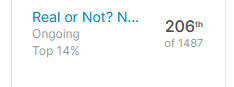

# Kaggle Disaster Tweets Challenge
This repository contains my notebooks for the Kaggle challenge ["Real or Not? NLP with Disaster Tweets"](https://www.kaggle.com/c/nlp-getting-started/overview).
If you have questions, feel free to contact my [via Twitter](https://twitter.com/stefanpreusler) :smiley:

## Description

English notebooks have an `en_` as prefix. The implemented model follows after the underscore `_`.

## Libraries used
- numpy
- pandas
- scikit-learn
- fastai
- transformers
- torch

## Results

Top 14% with the [RoBERTa model](en_roberta.ipynb) approach.